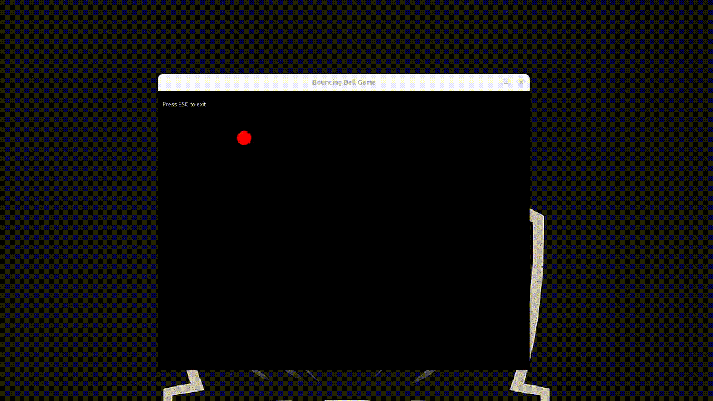

# Graphics Simple Library (GSL)

**GSL** ialah perpustakaan grafik ringkas dalam **Java** yang dibina berasaskan  
`JFrame`, `Canvas` dan `BufferStrategy` yang terinspirasi daripada **Borland Graphics Interface (BGI)**.  

Direka khas untuk:
- Projek latihan  
- Demo grafik  
- Mini game 2D
- Tanpa memerlukan perpustakaan luaran.

---

## Ciri-ciri

- Warna standard tersedia (`RED`, `GREEN`, `BLUE`, dll)  
- Input Keyboard (`iskeydown`, `iskeypressed`, `iskeyreleased`)  
- Input Mouse (`getmousex`, `getmousey`, dll)  
- Bentuk Asas: `line`, `putpixel`, `arc`, `pieslice`, `sector`, `bar`, `bar3`, `ellipse`, `fillellipse`, `circle`, `drawpoly`, `fillpoly`
- Teks: `outtextxy`
- Imej: `loadimage`, `drawimagepixels`, `putimage`, `createimage`, `saveframe`
- Frame Control: `setFrameRate(fps)`, `cleargraph()`, `refreshgraph()`  
- Anti-aliasing & gaya: `setstrokewidth()`, `setfont()`  
- Window Lifecycle: `initgraph()`, `closegraph()`  

---

## Fungsi dan Pemboleh ubah tetap

#### Pemboleh ubah tetap
- Warna
  - RED
  - GREEN
  - BLUE
  - BLACK
  - WHITE
  - TRANSPARENT
  - YELLOW
  - CYAN
  - MAGENTA
  - GRAY
  - SILVER
  - MAROON
  - OLIVE
  - LIME
  - TEAL
  - NAVY
  - PURPLE

- Kunci
  - KEY_ESCAPE
  - KEY_HOME
  - KEY_UP
  - KEY_PAGE_UP
  - KEY_LEFT
  - KEY_RIGHT
  - KEY_END
  - KEY_DOWN
  - KEY_PAGE_DOWN
  - KEY_INSERT
  - KEY_DELETE
  - KEY_F1
  - KEY_F2
  - KEY_F3
  - KEY_F4
  - KEY_F5
  - KEY_F6
  - KEY_F7
  - KEY_F8
  - KEY_F9
  - KEY_A
  - KEY_B
  - KEY_C
  - KEY_D
  - KEY_E
  - KEY_F
  - KEY_G
  - KEY_H
  - KEY_I
  - KEY_J
  - KEY_K
  - KEY_L
  - KEY_M
  - KEY_N
  - KEY_O
  - KEY_P
  - KEY_Q
  - KEY_R
  - KEY_S
  - KEY_T
  - KEY_U
  - KEY_V
  - KEY_W
  - KEY_X
  - KEY_Y
  - KEY_Z

- Butang Tetikus
  - MOUSE_BUTTON_LEFT
  - MOUSE_BUTTON_MIDDLE
  - MOUSE_BUTTON_RIGHT

#### Fungsi

(Init Window)
- initgraph(String title)
- initgraph(String title, int width, int height)
- initwindow(String title, int x, int y, int width, int height)


---

## Cara Guna

### 1. Masukkan perpustakaan
```java
import com.clay.gsl.Graphics;
```

### 2. Contoh Demo.java Asas
```java
import static com.clay.gsl.Graphics.*;

public class Demo {
    public static void main(String[] args) {

        initgraph("Demo GSL");

        while (true) {
            cleargraph();
            // Write code event here

            // Write code shape here

            refreshgraph();
        }
    }
}
```

### Contoh BouncingBall.java
```java
package com.clay.test;

import static com.clay.gsl.Graphics.*;

public class BouncingBall {
    public static void main(String[] args) {
        initgraph("Bouncing Ball Game");

        int x = 100, y = 100;
        int dx = 2, dy = 2;
        int radius = 30;

        while (true) {
            cleargraph();
            // gerakkan bola
            x += dx;
            y += dy;

            // pantulan dinding
            if (x < 0 || x + radius> getwindowwidth()) dx = -dx;
            if (y < 0 || y + radius> getwindowheight()) dy = -dy;

            // lukis bola
            setcolor(RED);
            fillellipse(x, y, radius, radius);

            // tunjuk teks
            setcolor(WHITE);
            outtextxy("Press ESC to exit", 10, 20);

            // input keluar
            if (iskeydown(KEY_ESCAPE)) closegraph();
            refreshgraph();
            delay(5);
        }
    }
}
```

### Demo BouncingBall



